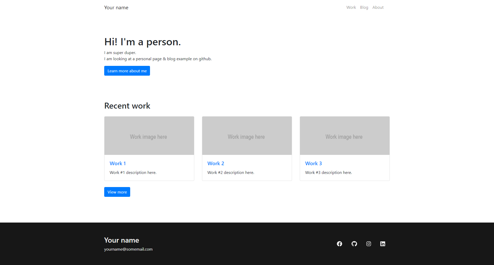
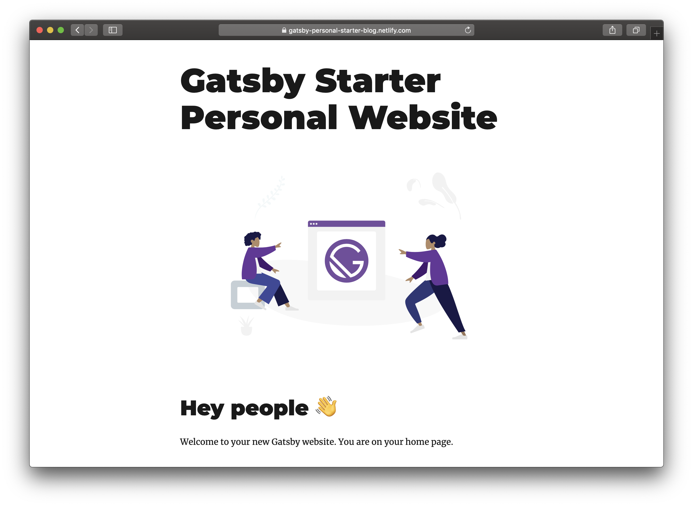

<!-- AUTO-GENERATED-CONTENT:START (STARTER) -->
<h1 align="center">
  Personal page and blog built with Gatsby, modified with Bootstrap styles
</h1>



This repo is a fork of [Gatsby's personal blog starter](https://github.com/thomaswang/gatsby-personal-starter-blog). The content of the original README is included below installation instructions. You can see this site in action here: [demo](https://cocky-turing-f83a29.netlify.com/).

## 🏭 Installation

This site can also be created with Gatsby CLI, see `Quick start` for further instructions.
```sh
gatsby new my-blog-starter https://github.com/XcrossD/gatsby-personal-page
```
Alternatively, install by yourself.
```sh
git clone https://github.com/XcrossD/gatsby-personal-page.git
npm install
```

---

<p align="center">
  <a href="https://www.gatsbyjs.org">
    
  </a>
</p>
<h1 align="center">
  Gatsby's personal blog starter
</h1>



This starter is a fork of Gatsby Starter Blog, the most popular starter by far – with second place being Gatsby Starter Netlify CMS. So I decided to combine the 2!

## 🚀 Quick start

1.  **Create a Gatsby site.**

    Use the Gatsby CLI to create a new site, specifying the blog starter.

    ```sh
    # create a new Gatsby site using the blog starter
    gatsby new my-blog-starter https://github.com/thomaswang/gatsby-personal-starter-blog
    ```

1.  **Start developing.**

    Navigate into your new site’s directory and start it up.

    ```sh
    cd my-blog-starter/
    gatsby develop
    ```

1.  **Open the source code and start editing!**

    Your site is now running at `http://localhost:8000`!

    _Note: You'll also see a second link: _`http://localhost:8000/___graphql`_. This is a tool you can use to experiment with querying your data. Learn more about using this tool in the [Gatsby tutorial](https://www.gatsbyjs.org/tutorial/part-five/#introducing-graphiql)._

    Open the `my-blog-starter` directory in your code editor of choice and edit `src/pages/index.js`. Save your changes and the browser will update in real time!

## 🎓 Learning Gatsby

Looking for more guidance? Full documentation for Gatsby lives [on the website](https://www.gatsbyjs.org/). Here are some places to start:

- **For most developers, we recommend starting with our [in-depth tutorial for creating a site with Gatsby](https://www.gatsbyjs.org/tutorial/).** It starts with zero assumptions about your level of ability and walks through every step of the process.

- **To dive straight into code samples, head [to our documentation](https://www.gatsbyjs.org/docs/).** In particular, check out the _Guides_, _API Reference_, and _Advanced Tutorials_ sections in the sidebar.

## 📔 Learning Netlify CMS with Gatsby

Start from [this point](https://www.gatsbyjs.org/docs/sourcing-from-netlify-cms/#authenticating-with-github) in the Gatsby documentation to finish the set up for your personal Netlify CMS with authentication.

## 💫 Deploy

[](https://app.netlify.com/start/deploy?repository=https://github.com/XcrossD/gatsby-personal-page)

<!-- AUTO-GENERATED-CONTENT:END -->
